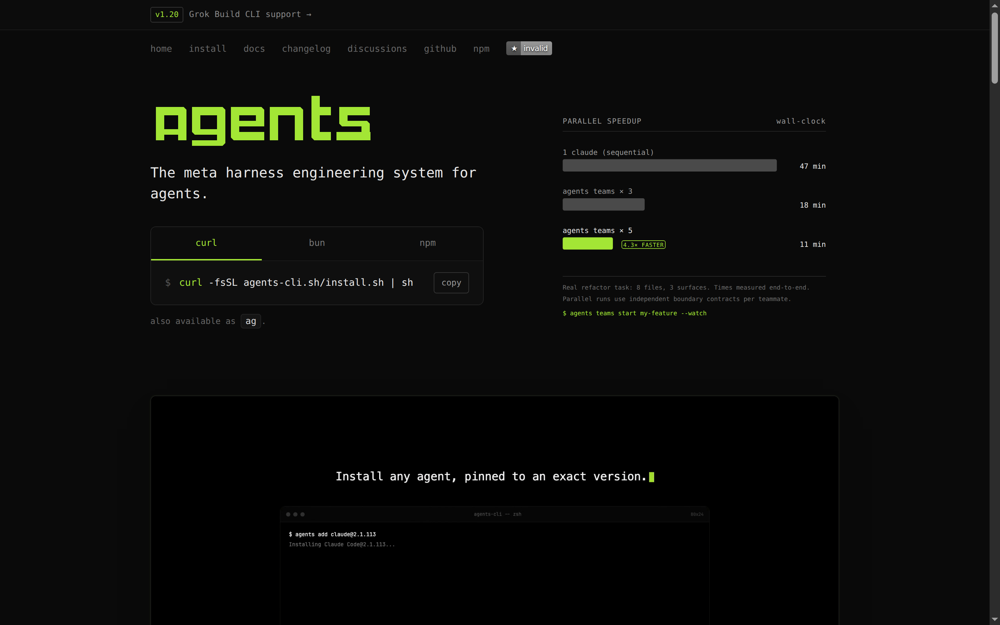
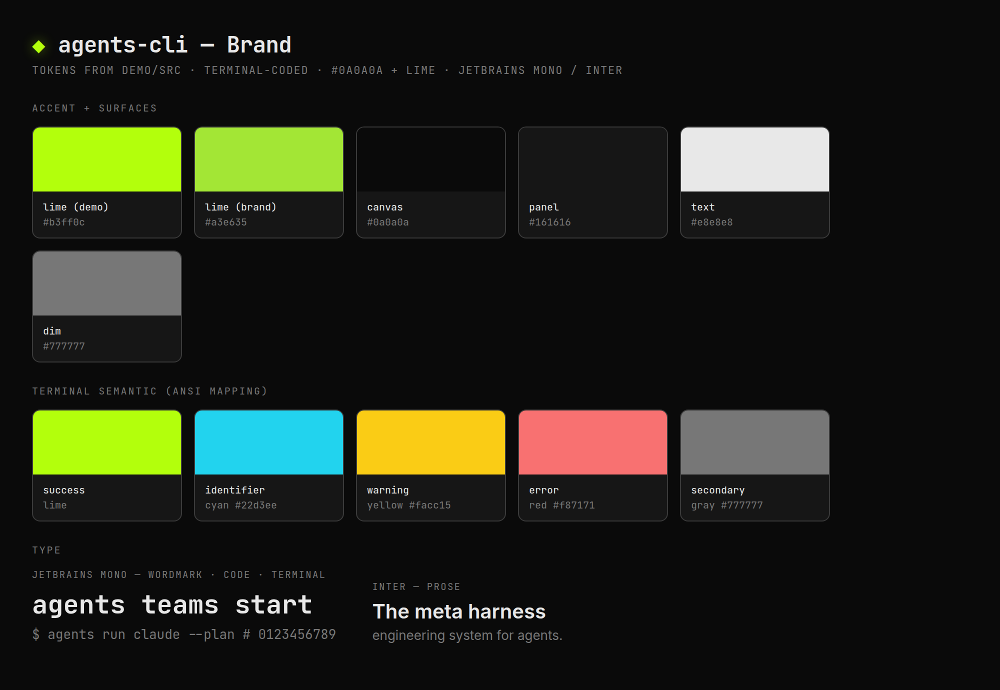
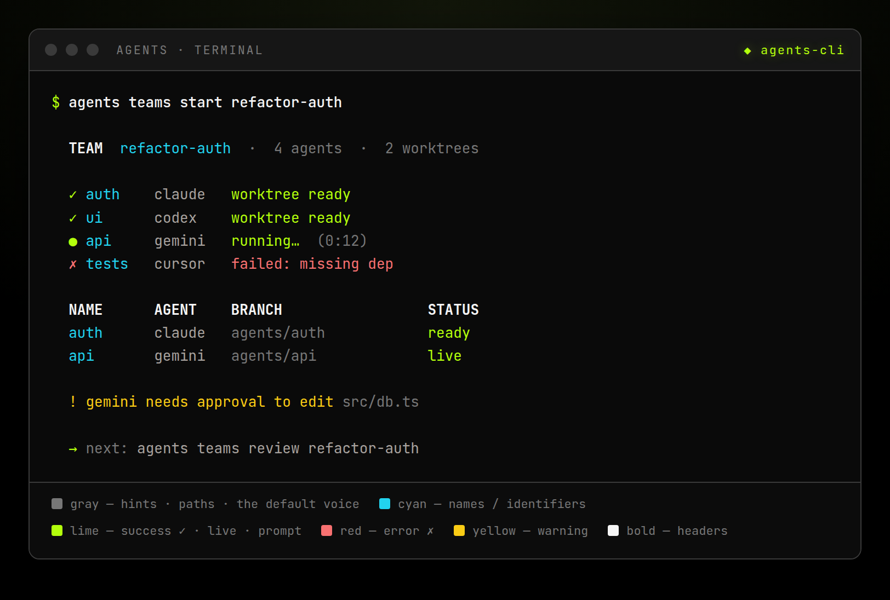

## Overview

agents-cli is a **terminal-first tool that also wears a web face**. The same brand shows up in two mediums, and the design job is to make them feel like one product:

- **The terminal** — the primary surface. Thousands of lines of `chalk`-colored output, spinners, and aligned monospace tables. This is where the tool lives.
- **The web** — the [agents-cli.sh](https://agents-cli.sh) landing page. The same identity rendered in HTML, and it leans *harder* into the terminal aesthetic than the CLI: `#0a0a0a` canvas, one neon-lime accent, and monospace almost everywhere — a JetBrains Mono wordmark over a system `ui-monospace` body. The page reads like a `man` page that happens to be a website.

> **Not the Rush/Swarmify brand.** agents-cli is Phoenix Labs OSS and terminal-coded; it does not use Swarmify's Geist/coral system. The Swarmify VS Code extension mirrors this *palette* (lime on black) but is a separate product with its own design doc — don't import its tokens here.

The through-line across both surfaces is **quiet, dense, high-signal**. The tool is mostly gray — secondary text, paths, hints — so that the rare colored element (a lime success, a red failure, a lime call-to-action) carries real weight. The brand personality is a *developer-first performance instrument*: the landing headline is "The meta harness engineering system for agents," and the hero stat is "4.3× FASTER." Nothing is decorative; every glyph and color is a status signal.

*The live [agents-cli.sh](https://agents-cli.sh) hero (captured in Brave). Tokens below are computed from this page.*

## Colors

There are two color systems, because there are two renderers.

### Web (live landing)

The brand is **one lime on a near-black canvas.** `#a3e635` — confirmed on the live site as `rgb(163,230,53)` — is the *only* accent, used sparingly for the wordmark, CTAs, and highlights (plus a `rgba(163,230,53,0.04)` wash on hover rows). Surfaces are a tight near-black ladder: `#0a0a0a` canvas → `#0f0f0f` well → `#141414` panel, hairlined in `#333333`. Text steps down `#e8e8e8` → `#d8d8d8` → `#888888` → `#666666` → `#333333`. (All values computed from the live agents-cli.sh, not a mockup.)

### Terminal (ANSI via chalk)

The CLI never hardcodes hex — it uses `chalk`'s semantic ANSI names, so output respects the user's own terminal theme. What's fixed is **meaning**, and the meaning is remarkably consistent across the codebase (usage counts from `src/`):

| Role | chalk color | Used for | Frequency |
|---|---|---|---|
| Secondary | `gray` / `dim` | Hints, paths, disabled state, metadata — the default voice | ~1188× |
| Error | `red` | Failures, blocked actions, `✗` | ~492× |
| Warning | `yellow` | Platform-gated features, pending, caution | ~304× |
| Success | `green` | Enabled, completed, `✓` / `●` / `+` markers | ~295× |
| Emphasis | `bold` | Table column headers (`NAME`, `BUNDLE`), section titles | ~272× |
| Identifier | `cyan` | Names of things — teams, agents, files, aliases, keys, `[user]` | ~198× |
| Value | `white` | Primary literal values | ~52× |

`magenta` and `blue` appear rarely (~24× / ~22×) as one-off accents; reach for them almost never. The dominance of gray is the point: **the terminal is calm by default, and color is the exception that means something.**

*Representative render (JetBrains Mono; role hexes from `demo/src` — lime success, cyan names, gray hints, red/yellow status). Actual colors resolve to the user's terminal theme.*

## Typography

**Web:** the live landing is **monospace-dominant** — a **JetBrains Mono** wordmark sits over a system **`ui-monospace`** stack (`SFMono-Regular, "SF Mono", Menlo, Consolas`) that carries body, code, and UI alike. There's almost no sans on the page; the terminal look *is* the type. The brand spec and promo demo (`demo/src/index.css` `@font-face`) additionally pair JetBrains Mono (code) with **Inter** (prose) for richer, non-terminal contexts — but the shipped site stays mono.

**Terminal:** typography is the user's terminal font; the CLI controls only weight (`bold`), dimming (`dim`), and layout. Hierarchy is created with **column alignment** (`.padEnd()` fixed-width columns) and `bold` headers, not type size — a monospace grid is the only typographic tool a terminal has, so lean on it.

## Layout

**Terminal layout is a monospace grid.** Tables are built from space-padded columns (`'NAME'.padEnd(24)`, `.padEnd(16)`, `.padEnd(28)`) with a `bold` header row, so everything aligns without box-drawing chrome. Conventions:

- **Two-space indent** for sub-lines and detail rows under a heading.
- **`backtick`-wrapped command hints** in gray (e.g. `` `agents menubar enable` ``) so the next action is always literally spelled out.
- **Aligned key/value pairs** — label left, value right, padded to a common width.
- No heavy ASCII boxes; alignment and color do the structuring.

**Web layout** is a dark, terminal-coded landing: a centered column on the `#0a0a0a` canvas, panels in `#141414` on `#0f0f0f` wells hairlined with `#333333`, generous whitespace around a single lime call-to-action. Install commands sit in a tabbed code block (`curl` / `bun` / `npm`); metrics render as labeled gauge bars (the parallel-speedup panel).

## Shapes

**Web:** tight, mechanical corners on a `3 / 4 / 6 / 8px` radius scale (buttons `4px`, panels `6px`, cards `8px`) — hardware has crisp edges.

**Terminal:** shape is glyph vocabulary. A small, fixed set carries all state — do not invent new ones:

- `✓` success · `✗` failure
- `●` active / on · `○` inactive / off
- `→` flow or "leads to" · `←` annotation pointer (e.g. `← this machine`)
- `·` `•` bullets · `—` section separator · `-` list marker (the workhorse)

## Components

### Web
Primary button: solid lime (`#a3e635`), near-black text (`#0a0a0a`), `4px` radius — the one call-to-action per view. Panels are `#141414` on `#0f0f0f` wells, hairlined in `#333333`; wordmark in JetBrains Mono, everything else in the system `ui-monospace` stack. Keep web chrome minimal — the landing sells the terminal, so it should read like one.

### Terminal
- **Status line** — glyph + colored label + gray detail: `✓ Menu bar helper enabled.` then dim follow-up.
- **Spinner** — `ora` for any async step (installs, syncs, network); resolve it to a `green ✓` or `red ✗` line, never leave it spinning.
- **Table** — `bold` UPPERCASE header row, `.padEnd()` columns, `cyan` names, `gray` metadata, status glyphs in the state column.
- **Hint** — two-space-indented gray line with a `backtick` command, appended after an action so the user always knows the next move.
- **Error** — `red` message + a `gray` "why / how to fix" follow-up line; never a bare stack trace.

## Do's and Don'ts

**Do:**
- Keep the terminal quiet — `gray` is the default; reserve `green`/`red`/`yellow`/lime for signal.
- Use the semantic role, not the raw color: think "this is an error" (`red`), "this is a name" (`cyan`), not "make it red."
- Align terminal output into a monospace grid with `.padEnd()` and `bold` headers.
- Always spell out the next action as a `backtick` command hint in gray.
- Resolve every `ora` spinner into a terminal ✓/✗ line.
- Keep web and terminal reading as one brand: lime accent, near-black, calm-by-default.

**Don't:**
- Hardcode hex colors in CLI output — use `chalk`'s semantic names so the user's theme is respected.
- Over-color the terminal — a wall of green/yellow destroys the signal that color is supposed to carry.
- Invent new status glyphs beyond the fixed set, or new chalk roles (avoid `magenta`/`blue` unless truly one-off).
- Emit emojis or decorative flair (repo hard rule: no emojis anywhere).
- Use toasts or spinner-that-never-ends UX — success is a quiet ✓, errors are inline red with a fix hint.
- Drift the web surface off lime + monospace (JetBrains Mono wordmark, system `ui-monospace` body), or pull in the Rush/Swarmify (Geist/coral) styling — the landing must stay terminal-coded and on one palette.
