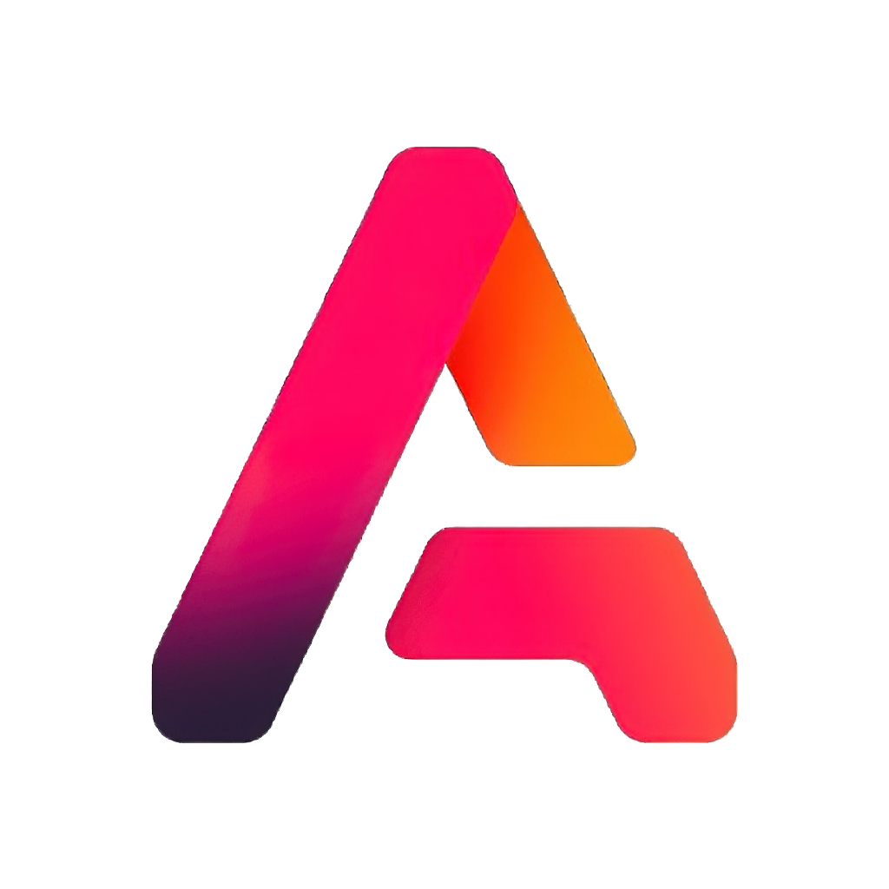
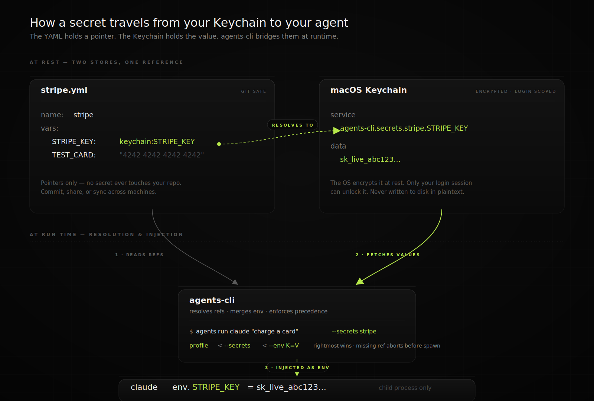

<p align="center">
  
</p>

<h1 align="center">agents</h1>

<p align="center">
  <a href="https://www.npmjs.com/package/@phnx-labs/agents-cli"></a>
  <a href="./LICENSE"></a>
  <a href="https://www.npmjs.com/package/@phnx-labs/agents-cli"></a>
  <a href="https://github.com/phnx-labs/agents-cli"></a>
</p>

**The missing toolchain for CLI coding agents.** Run any agent on your existing subscription. Spawn parallel teams in isolated terminals. Schedule routines, drive browsers and Electron apps, and store secrets behind Touch ID — all from one CLI.

<p align="center">
  <a href="https://github.com/anthropics/claude-code" title="Claude Code"></a>
  &nbsp;&nbsp;&nbsp;&nbsp;
  <a href="https://github.com/openai/codex" title="Codex CLI"></a>
  &nbsp;&nbsp;&nbsp;&nbsp;
  <a href="https://github.com/google-gemini/gemini-cli" title="Gemini CLI"></a>
  &nbsp;&nbsp;&nbsp;&nbsp;
  <a href="https://cursor.com" title="Cursor"></a>
  &nbsp;&nbsp;&nbsp;&nbsp;
  <a href="https://github.com/sst/opencode" title="OpenCode"></a>
  &nbsp;&nbsp;&nbsp;&nbsp;
  <a href="https://github.com/openclaw/openclaw" title="OpenClaw"></a>
  &nbsp;&nbsp;&nbsp;&nbsp;
  <a href="https://github.com/NousResearch/hermes-agent" title="Hermes Agent"></a>
  &nbsp;&nbsp;&nbsp;&nbsp;
  <a href="https://x.ai" title="Grok Build (xAI)"><strong>Grok</strong></a>
</p>

https://agents-cli.sh/demo.mp4

```bash
npm install -g @phnx-labs/agents-cli
# or
bun install -g @phnx-labs/agents-cli
```

Source: [github.com/phnx-labs/agents-cli](https://github.com/phnx-labs/agents-cli)

Also available as `ag` -- all commands work with both `agents` and `ag`.

- [Pin versions per project](#pin-versions-per-project)
- [One config, every agent](#one-config-every-agent)
- [Run any agent](#run-any-agent)
- [Sessions across agents](#sessions-across-agents)
- [Run open models through Claude Code](#run-open-models-through-claude-code)
- [Teams](#teams)
- [Workflows](#workflows)
- [Browser](#browser)
- [Secrets](#secrets)
- [Routines](#routines)
- [PTY](#pty)
- [Portable setup](#portable-setup)
- [Private skills](#private-skills)
- [Security & Privacy](#security--privacy)
- [Compatibility](#compatibility)
- [FAQ](#faq)

---

## Pin versions per project

```bash
# This project needs claude@2.0.65 -- newer versions changed tool calling.
agents use claude@2.0.65 -p

# The monorepo uses codex@0.116.0 across the team.
agents use codex@0.116.0 -p
```

This creates an `agents.yaml` at the project root:

```yaml
# agents.yaml (commit this to your repo)
agents:
  claude: "2.0.65"
  codex: "0.116.0"
```

Think `requirements.txt` for CLI coding agents, on steroids. A shim reads `agents.yaml` from the project root and routes `claude` / `codex` / `gemini` / `grok` (and others) to the right version automatically. Each version gets its own isolated home -- switching backs up config and re-syncs resources.

```bash
agents add claude@2.0.65     # Install a specific version
agents add codex@latest       # Install latest
agents view                   # See everything installed
```

---

## One config, every agent

```bash
# Set up the Notion MCP server once.
agents install mcp:com.notion/mcp

# It's now registered with Claude Code, Codex, Gemini CLI, and Cursor.
agents mcp list
```

Skills, slash commands, rules, hooks, and permissions work the same way -- install once in `~/.agents/`, synced to every agent's native format automatically.

```bash
agents skills add gh:yourteam/python-expert     # Knowledge pack -> all agents
agents commands add gh:yourteam/commands         # Slash commands -> all agents
agents rules add gh:team/rules                   # AGENTS.md -> CLAUDE.md, GEMINI.md, .cursorrules
agents permissions add ./perms                   # Permissions -> auto-converted per agent
```

Write one `AGENTS.md`. It becomes `CLAUDE.md` for Claude Code, `GEMINI.md` for Gemini CLI, `.cursorrules` for Cursor.

---

## Run any agent

```bash
agents run claude "Find all auth vulnerabilities in src/"
agents run codex "Fix the issues Claude found"
agents run gemini "Write tests for the fixed code"
```

Each resolves to the project-pinned version with skills, MCP servers, and permissions already synced.

### Rate-limited? Keep working.

```bash
# Claude Code hits a rate limit -> Codex picks up automatically. Same project, same config.
agents run claude "refactor auth module" --mode edit --fallback codex,gemini
```

### Multiple accounts? Spread the load.

```bash
# Picks the signed-in account you haven't used recently.
agents run claude "summarize recent commits" --strategy balanced
```

`--strategy balanced` spreads work across available versions of the same agent -- useful when you have multiple accounts and want to avoid burning through one.

### Chain agents

```bash
agents run claude "Review PRs merged this week, summarize risks" \
  | agents run codex "Write regression tests for the top 3 risks"
```

Supports plan (read-only) and edit modes, effort levels, JSON output for scripting, and timeout limits.

### One protocol, every harness

```bash
# Typed event stream instead of raw stdout. Same command, any supported agent.
agents run claude "review this diff" --acp --json
```

`--acp` routes through the [Agent Client Protocol](https://github.com/zed-industries/agent-client-protocol) so you get a unified event stream -- `agent_message_chunk`, `tool_call`, `plan_update`, `stop_reason` -- instead of writing a parser per CLI. File writes and shell commands flow through agents-cli, which means `--mode plan` becomes a real sandbox: the write RPC is denied, not just unused.

ACP adapters are documented for claude, codex, gemini, cursor, opencode, openclaw, and grok. Other harnesses keep running on the direct-exec path.

---

## Sessions across agents

When you run multiple agents, conversations scatter across tools. Session search brings them together.

```bash
# Where was that auth conversation? Search Claude Code, Codex, Gemini CLI, OpenCode at once.
agents sessions "auth middleware"

# Filter by agent, project, or time window
agents sessions --agent codex --since 7d
agents sessions --project my-app

# Read a full conversation
agents sessions a1b2c3d4 --markdown

# Just the last 3 turns, user messages only
agents sessions a1b2c3d4 --last 3 --include user
```

Interactive picker when you're in a terminal. Structured output (`--json`, `--markdown`, filtered by role or turn count) when piped.

Backed by a SQLite + FTS5 index at `~/.agents/.history/sessions/sessions.db` with incremental scanning -- warm reads in ~100ms. External tools can consume `--json` output as a programmatic observability layer; see [docs/05-sessions.md](docs/05-sessions.md) for the schema and [docs/06-observability.md](docs/06-observability.md) for the consumption patterns.

---

## Run open models through Claude Code (experimental)

> **Note:** Profiles are experimental. Enable with `agents beta profiles enable`.

```bash
# Kimi K2.5 responding inside Claude Code's UI, tools, and skills.
# No proxy server. No LiteLLM. One OpenRouter key, stored in Keychain.
agents profiles add kimi
agents run kimi "refactor this file"
```

Built-in presets (all via OpenRouter, one shared key):

| Preset | Model | Notes |
|---|---|---|
| `kimi` | Kimi K2.5 | #1 HumanEval. Reasoning -- interactive only. |
| `minimax` | MiniMax M2.5 | #1 SWE-bench Verified. Reasoning. |
| `glm` | GLM 5 | #1 Chatbot Arena (open-weight). |
| `qwen` | Qwen3 Coder Next | Latest coding Qwen. Print-safe. |
| `deepseek` | DeepSeek Chat V3 | Latest non-reasoning. Print-safe. |

A profile swaps the model while keeping Claude Code as the agent runtime -- same UI, slash commands, skills, MCP tools. Under the hood: `ANTHROPIC_BASE_URL` + `ANTHROPIC_MODEL`, auth from Keychain at spawn time.

Custom endpoints (Ollama, vLLM) work too -- drop a YAML in `~/.agents/profiles/`:

```yaml
name: local-qwen
host: { agent: claude }
env:
  ANTHROPIC_BASE_URL: https://ollama.example.com
  ANTHROPIC_MODEL: qwen3.6:35b
auth:
  envVar: ANTHROPIC_AUTH_TOKEN
  keychainItem: agents-cli.ollama.token
```

Profile YAML has no secrets -- safe to `agents repo push` to a shared repo. `agents profiles presets` lists the full catalog.

---

## Teams

```bash
agents teams create auth-feature

# Research first, then implement, then test.
agents teams add auth-feature claude "Research auth libraries"       --name researcher
agents teams add auth-feature codex  "Draft the migration"           --name migrator --after researcher
agents teams add auth-feature claude "Write tests for the new code"  --name tester   --after migrator

agents teams start auth-feature     # Fires teammates whose deps are done
agents teams status auth-feature    # Who's working, what they changed, what they said
```

Teammates run detached -- close your terminal, they keep working. Check in with `teams status`, read full output with `teams logs <name>`, clean up with `teams disband`.

Team state is observable via `agents teams list --json` / `agents teams status --json` (compact by default; add `--verbose` for the full per-teammate shape). External tools join it with `sessions --json` (teammates get `isTeamOrigin: true`) and `cloud list --json` (for `--cloud` teammates) to build a unified fleet view. See [docs/06-observability.md](docs/06-observability.md).

---

## Workflows

Bundle an orchestrator prompt with optional subagents, skills, and plugins into a named, reusable pipeline. One bundle, one invocation.

```bash
# Use a workflow — workflow name goes in the agent slot
agents run code-review "review PR #42 on acme/api"

# List + inspect
agents workflows list
agents workflows view code-review

# Install from GitHub or local
agents workflows add gh:yourteam/code-review
agents workflows add ./my-workflow
```

A workflow is a directory:

```
~/.agents/workflows/code-review/
  WORKFLOW.md          # YAML frontmatter + orchestrator system prompt
  subagents/           # optional: *.md files exposed to the orchestrator
    security.md
    style.md
  skills/              # optional: knowledge packs scoped to this workflow
  plugins/             # optional: plugin bundles
```

`WORKFLOW.md`'s Markdown body is the orchestrator's system prompt. Files under `subagents/` get copied to `~/.claude/agents/` at run time so the built-in Agent tool can dispatch to them by name — including in parallel. `skills/` and `plugins/` sync into the version home just for the run.

```yaml
# WORKFLOW.md frontmatter
---
name: Code Review
description: Evidence-grounded PR review with file:line citations.
model: opus
tools:
  - Read
  - Grep
  - Bash
  - WebFetch
---
```

Workflows that need to write — post PR comments, edit files, send Slack — should run with `--mode edit` or `--mode full`. `agents run` defaults to `--mode plan` (read-only), which deadlocks at `ExitPlanMode` in headless runs.

Resolution is project > user > system: a `<repo>/.agents/workflows/<name>/` overrides a same-named workflow in `~/.agents/workflows/`. Commit project workflows with your repo so teammates get the same pipeline.

---

## Plugins

Bundle skills, commands, hooks, MCP servers, settings, and permissions under a single manifest. One source dir at `~/.agents/plugins/<name>/`, mirrored into every installed Claude / OpenClaw version automatically.

```bash
# Install from a git URL or local path
agents plugins install hivemind@https://github.com/activeloopai/hivemind.git
agents plugins install ./my-plugin

# Apply to one agent (default version) or all supported
agents plugins sync rush-toolkit claude
agents plugins sync rush-toolkit
```

A plugin is a directory with a manifest:

```
~/.agents/plugins/my-plugin/
  .claude-plugin/plugin.json       # required: { name, version, description }
  skills/<name>/SKILL.md           # optional
  commands/*.md                    # optional
  hooks/hooks.json                 # optional — executable surface
  .mcp.json                        # optional — executable surface
  bin/, scripts/, settings.json    # optional — executable surface
  permissions/                     # optional — executable surface
```

On sync, agents-cli copies the plugin into each version home's marketplace (`<home>/.claude/plugins/marketplaces/agents-cli/plugins/<name>/`), registers the synthetic marketplace, and flips `settings.json#enabledPlugins[<name>@agents-cli] = true` so Claude / OpenClaw load it.

### Executable-surface gate

Plugins that ship `hooks/`, `.mcp.json`, `bin/`, `scripts/`, `settings.json` (non-permissions), or `permissions/` can execute code on session events. agents-cli requires explicit consent before flipping `enabledPlugins`:

```bash
# Hooks-bearing plugins copy in but stay disabled by default
agents plugins install hivemind@https://github.com/activeloopai/hivemind.git \
  --allow-exec-surfaces

# Same gate on re-sync (e.g., after upstream updates)
agents plugins sync hivemind claude --allow-exec-surfaces
```

Skills, commands, and subagents are declarative and never trip the gate. The gate is per-plugin, per-install: consenting to hivemind doesn't grant blanket exec-surface trust to anything else.

### Version portability

Plugins live in the user repo (`~/.agents/plugins/`), not inside any single version home. Switching Claude via `agents use claude@<v>` re-syncs the plugin into the new version automatically — no re-install. New Claude versions added later pick it up on their first sync. Project-level `<repo>/.agents/plugins/<name>/` overrides a same-named user plugin (resolution is project > user > system, same as every other resource).

---

## Browser

Give agents access to a real browser — no relay extension, no cloud service, no Playwright getting blocked.

```bash
# First run: omit --profile and we auto-pick the first installed Chromium-family
# browser. macOS prefers Chrome > Brave > Edge > Chromium > Comet; Linux prefers
# Chrome > Chromium > Brave > Edge; Windows prefers Edge (always preinstalled) >
# Chrome > Brave. The auto-picked profile is saved as "default" for later runs.
export AGENTS_BROWSER_TASK=$(agents browser start --url https://app.example.com)

# Or pin a named profile to a specific browser (chrome, comet, brave, chromium,
# edge, or custom) when you want isolation from "default".
agents browser profiles create work --browser chrome
# `start` writes the resolved name (e.g. `swift-crab-falcon-a3f92b1c`) to stdout
# and human-friendly commentary to stderr, so $(...) capture stays clean.
export AGENTS_BROWSER_TASK=$(agents browser start --profile work --url https://app.example.com)
agents browser refs                  # Get interactive element refs
agents browser click 42              # Click element ref 42
agents browser type 15 --text "hello"  # Type into element ref 15
agents browser screenshot            # Smart resizing, token-efficient
agents browser tabs                  # List tabs open for the current task
agents browser tab focus tab123      # Switch focus to another tab
agents browser done                  # Close task's tabs when finished

# Need to address a different task in the same shell? Override per call:
agents browser screenshot --task other-flow
```

### Why this works where Playwright fails

Playwright and Puppeteer spin up fresh browser instances with automation flags. Sites like LinkedIn, Google, and most finance apps detect and block them immediately.

`agents browser` launches your existing residential Chrome (or Brave, Edge, Chromium) on your machine via CDP. Same browser fingerprint, same IP, same everything. Sites can't detect automation because you're using the same browser you'd use manually.

### Token-efficient automation

The CLI handles the mechanical work so agents don't burn tokens on low-level browser commands. Screenshots are automatically resized without excessive compression — agents process smaller images while keeping the detail they need to make decisions.

### Profile isolation

Multiple agents can run browser tasks simultaneously without stepping on each other. Each profile gets its own user data directory, cookies, and state. One agent logs into your work Slack, another into your personal email — no conflicts, no shared state.

```bash
agents browser profiles create work-slack --browser chrome
agents browser profiles create personal-gmail --browser chrome
# Two agents, two profiles, no interference
```

### Safe credential access

Attach a [secrets bundle](#secrets) to a profile. The agent can log in without credentials in plaintext, and every secret access is recorded in the session log.

```bash
agents browser profiles create bank --browser chrome --secrets bank-creds
```

### Electron apps

Control Electron apps (Slack, Discord, VS Code, your own app) with custom binaries:

```bash
agents browser profiles create slack \
  --browser custom \
  --binary "/Applications/Slack.app/Contents/MacOS/Slack" \
  --electron
```

### Remote browsers

Connect to browsers running anywhere — local, SSH tunnels, or cloud services:

```bash
# Local CDP (discovers WebSocket URL automatically)
agents browser profiles create local-debug \
  --browser chrome \
  --endpoint "http://localhost:9222"

# SSH tunnel to a remote machine
agents browser profiles create staging \
  --browser chrome \
  --endpoint "ssh://deploy@staging.example.com?port=9222"

# Cloud browser services (BrowserBase, Steel, etc.)
agents browser profiles create cloud \
  --browser chrome \
  --endpoint "wss://connect.browserbase.com?apiKey=..."
```

---

## Secrets

> **Platform:** `agents secrets` requires macOS Keychain or Linux libsecret.
> On Windows (non-WSL), use environment variables or a `.env` file instead.

```bash
# API keys in Keychain, not in .env files.
agents secrets create prod-stripe
agents secrets add prod-stripe STRIPE_SECRET_KEY     # Prompts, stores in Keychain
agents secrets add prod-stripe TEST_CARD --value "4242..."

# Injected at run time. Bundle definitions live in the Keychain, not on disk.
agents run claude "charge a test card" --secrets prod-stripe
```

<p align="center">
  
</p>

Merge order: profile env < `--secrets` < `--env K=V`. A missing keychain item aborts before the child starts.

### Cross-machine sync via iCloud Keychain

Secret bundles sync through iCloud Keychain by default. Sign into the same iCloud account on another Mac (with iCloud Keychain enabled) and the bundle appears there within seconds — no copy-paste, no `.env` files emailed to yourself, no shared secret stores. Pass `--no-icloud-sync` when creating a bundle if it should stay device-local.

```bash
# On laptop:
agents secrets create npm-tokens
agents secrets add npm-tokens NPM_TOKEN          # value lives in iCloud Keychain

# On another Mac (same iCloud account):
agents secrets list                              # npm-tokens is already there;
agents run claude "..." --secrets npm-tokens     # injects NPM_TOKEN automatically
```

Under the hood, synced bundles route writes through a notarized helper app (`Agents CLI.app`) that holds the entitlement macOS requires for `kSecAttrSynchronizable`. Bundles created with `--no-icloud-sync` stay device-local.

Bundle definitions sync via iCloud Keychain too — no `agents repo push` needed for secrets, no recreate step on each Mac. Nothing about secrets ever lives in plaintext on disk.

### Per-secret metadata and rotation

Tag each secret with `--type`, `--expires`, and `--note` so the bundle is self-documenting. `--expires` is always future-dated (`YYYY-MM-DD`); past or same-day values are rejected. Use `agents secrets rotate <bundle> <key>` to refresh a credential — `add` only creates new keys, `rotate` replaces the value and preserves metadata unless overridden.

```bash
agents secrets add prod STRIPE_API_KEY --type api-key --expires 2027-01-15 --note "Live key, owner: payments-team"
agents secrets rotate prod STRIPE_API_KEY --note "rotated after suspected leak"
agents secrets list   # EXPIRING column flags secrets due in the next 30 days
```

---

## Routines

```bash
# Claude Code reviews PRs every weekday at 9 AM. Scheduler auto-starts.
agents routines add daily-digest \
  --schedule "0 9 * * 1-5" \
  --agent claude \
  --prompt "Review yesterday's PRs and summarize key changes"

agents routines list                   # All jobs + next run times
agents routines run daily-digest       # Test it now, ignore the schedule
agents routines logs daily-digest      # Check last execution
```

Jobs run sandboxed -- agents only see directories and tools you explicitly allow.

---

## PTY

```bash
# Give agents a real terminal for REPLs, TUIs, interactive programs.
SID=$(agents pty start)
agents pty exec $SID "python3"
agents pty screen $SID                # Clean text, no ANSI -- what a human sees
agents pty write $SID "print('hello')\n"
agents pty stop $SID
```

A sidecar server holds sessions alive between CLI calls. `screen` renders via xterm-headless. Sessions auto-clean after 30 minutes idle.

---

## Portable setup

```bash
# New machine? One command.
agents setup

# Installs CLIs, registers MCP servers, syncs skills/commands/rules/hooks,
# sets up shims, configures defaults. Done.

agents repo push     # Snapshot your config to git
```

### How config is layered

Two repos with the same shape, different roles:

| Repo | Role | Owner |
|---|---|---|
| `~/.agents-system/` | **System repo** — core/built-in skills, commands, hooks, rules, MCP configs, permissions, and profiles that ship with `agents-cli`. The defaults every install gets. | Maintained upstream at [phnx-labs/.agents-system](https://github.com/phnx-labs/.agents-system) |
| `~/.agents/` | **User repo** — your personal additions and overrides. This is what `agents repo push`/`pull` syncs. | You |

**Version pinning:** `agents.yaml` at project root pins which agent version to use (like `.nvmrc` for Node).

**Resource resolution:** When syncing resources (commands, skills, rules, hooks, MCP, permissions), the order is **project > user > system**. A `.agents/` directory at project root wins, then `~/.agents/`, then `~/.agents-system/`. Same-named resources higher in the chain override lower ones; everything else unions in.

See [docs/00-concepts.md](docs/00-concepts.md) for the full mental model: DotAgents repos, resource kinds, and how resolution works end-to-end.

Other useful commands: `agents doctor` checks CLI availability and resource sync drift, `agents usage` shows available quota/rate-limit data for installed agents, `agents import` adopts an existing unmanaged install, `agents trash` lists and restores soft-deleted version directories, and `agents subagents` installs reusable subagent definitions for parent-agent workflows.

---

## Private skills

Keep work or personal skills in a separate repo — public ones in `~/.agents/`, private ones in an extra repo that merges in at sync time.

```bash
# Add a private repo for work-only skills
agents repo add gh:yourname/.agents-work

# Add with a custom alias
agents repo add git@github.com:acme/team-skills.git --as acme

agents repo list          # Primary + every registered extra
agents repo pull          # Pull updates for all enabled extras
agents repo disable acme  # Stop merging without deleting
agents repo remove acme   # Unregister and delete the clone
```

Extras clone into `~/.agents-system/.repos/<alias>/` and ship the same layout as the primary (`skills/`, `commands/`, `hooks/`, `rules/`). Their contents merge into agent version homes after the primary's — so `~/.agents/` always wins on name collisions. `agents skills list` shows which repo each skill came from.

---

## Security & Privacy

**The CLI binary has no built-in telemetry or phone-home path.** Routine commands run locally; explicit features such as cloud dispatch and iCloud Keychain sync send only the data needed for the action you invoke. Here's exactly what `agents-cli` stores locally and why.

### Event log

Every agent run, version install, browser launch, and secrets access is logged to `~/.agents/.cache/logs/events-YYYY-MM-DD.jsonl`. This gives you a complete record of what agents did on your machine.

```bash
# What gets logged (example event):
{
  "ts": "2026-05-09T10:23:45Z",
  "event": "agent.run.end",
  "agent": "claude",
  "version": "2.1.121",
  "prompt": "Fix the auth bug in...",  # truncated to 200 chars
  "durationMs": 45230,
  "exitCode": 0,
  "hostname": "your-mac",
  "platform": "darwin"
}
```

**What's logged:** Operation type, agent, version, timing, prompt length + SHA-256 hash (raw text never stored), exit codes, errors, and secret bundle/key names with caller context. Argv entries that look like tokens or secret paths are redacted. **What's NOT logged:** Raw prompts, outputs, file contents, or secret values.

**Permissions:** Logs directory is `0700` (owner-only), files are `0600`. Only you can read them.

**Retention:** 7 days by default, then auto-pruned.

**Opt out:** Set `AGENTS_DISABLE_EVENT_LOG=1` in your shell to disable completely.

### Session search

Conversations with Claude, Codex, Gemini, and other agents scatter across their native storage. Session search indexes them locally so you can find any conversation:

```bash
agents sessions "auth middleware"     # Full-text search across all agents
agents sessions --agent claude --since 7d
```

The index lives at `~/.agents/.history/sessions/sessions.db` (SQLite + FTS5). Nothing leaves your machine. See [Sessions](#sessions-across-agents) for full usage.

### Secrets

API keys and credentials are stored in macOS Keychain, never in plaintext files. Bundle definitions also live in Keychain.

```bash
agents secrets create my-keys
agents secrets add my-keys API_KEY    # Prompts for value, stores in Keychain
```

By default, secrets sync via iCloud Keychain to your other Macs. With `--no-icloud-sync`, they stay device-local. See [Secrets](#secrets) for full usage.

### Summary

| Data | Location | Who can read | Opt out |
|------|----------|--------------|---------|
| Event log | `~/.agents/.cache/logs/` | You only (0600) | `AGENTS_DISABLE_EVENT_LOG=1` |
| Session index | `~/.agents/.history/sessions/` | You only | Delete the directory |
| Secrets | macOS Keychain | You + apps you authorize | Don't use `agents secrets` |
| Config | `~/.agents/` | You only | N/A |

---

## Compatibility

Which DotAgents resources each agent CLI can load. Source of truth: [src/lib/agents.ts](src/lib/agents.ts) (`capabilities`); gates use `supports(agent, cap, version)` from [src/lib/capabilities.ts](src/lib/capabilities.ts). Full matrix also in [docs/00-concepts.md](docs/00-concepts.md).

| Agent | Versions | Hooks | MCP | Permissions | Skills | Commands | Plugins | Subagents | Rules | Workflows |
|-------|----------|-------|-----|-------------|--------|----------|---------|-----------|-------|-----------|
| Claude Code | yes | yes | yes | yes | yes | yes | yes | yes | `CLAUDE.md` | yes |
| Codex CLI | yes | >= 0.116.0 | yes | no | yes | < 0.117.0 · skills ($name, >= 0.117) | >= 0.128.0 | no | `AGENTS.md` | no |
| Gemini CLI | yes | >= 0.26.0 | yes | no | yes | yes (.toml) | no | no | `GEMINI.md` | no |
| Antigravity | yes | yes | yes | yes | yes | yes | yes | no | `AGENTS.md` | no |
| Grok Build | yes | yes | yes | yes | yes | skills ($name) | yes | no | `AGENTS.md` | no |
| OpenClaw | yes | yes | yes | no | yes | gateway | yes | yes | `workspace/AGENTS.md` | no |
| Cursor | yes | no | yes | no | yes | yes | no | no | `.cursorrules` | no |
| OpenCode | yes | no | yes | no | yes | yes | no | no | `AGENTS.md` | no |
| Copilot | yes | no | yes | no | yes | yes | no | no | `AGENTS.md` | no |
| Amp | yes | no | yes | no | yes | yes | no | no | `AGENTS.md` | no |
| Kiro | yes | no | yes | no | yes | yes | no | no | `AGENTS.md` | no |
| Goose | yes | no | yes | no | no | no | no | no | `AGENTS.md` | no |
| Roo Code | yes | no | yes | no | yes | yes | no | no | `AGENTS.md` | no |

**Legend:** `yes` / `no` = synced or skipped at install time. `skills ($name)` = no file-based slash-command dir; behavior ships as a generated skill invoked with `$command`. `gateway` = OpenClaw resolves slash commands at runtime, not from synced files. Version suffixes are enforced at sync time — out-of-range versions are skipped with a clear message.

**Host CLIs** (`agents cli`) are separate: YAML manifests under `~/.agents/cli/` install binaries onto your PATH (`gh`, `higgsfield`, etc.). They are not copied into per-agent version homes.

### agents-cli features (not agent-native resources)

| Agent | Routines | Teams | Session index |
|-------|----------|-------|---------------|
| Claude Code | yes | yes | yes |
| Codex CLI | yes | yes | yes |
| Gemini CLI | yes | yes | yes |
| Cursor | -- | yes | -- |
| OpenCode | -- | yes | -- |
| Grok Build | -- | yes | yes |
| Antigravity | -- | yes | -- |
| Copilot | -- | -- | yes |
| OpenClaw, Amp, Kiro, Goose, Roo | -- | -- | -- |

### Version-gated sync

| Capability | Agent | Gate |
|------------|-------|------|
| Hooks | Codex | >= 0.116.0 |
| Hooks | Gemini | >= 0.26.0 |
| File-based commands | Codex | < 0.117.0 (0.117+ uses command-as-skill) |
| Plugins | Codex | >= 0.128.0 |

Codex `0.117.0+` no longer reads `.codex/prompts/`; agents-cli converts slash commands into skills so they stay invocable as `$name`. OpenCode's plugin-based hook system is on the roadmap; hooks stay `no` until a writer ships.

Slash commands can declare per-agent/version targeting in frontmatter (`agents:`, `since:`, `until:`). Gating applies when syncing from `~/.agents/commands/` (user/system) into version homes — project `.agents/commands/` files are read in place and are not filtered by `agents:`. This repo ships `.agents/commands/version.md` as `/version` for Claude, Codex, Gemini, Cursor, OpenCode, Copilot, and Grok; Antigravity excluded until verified.

## FAQ

### Why use `agents` instead of `claude` / `codex` / `gemini` directly?

Claude Code, Codex CLI, Gemini CLI, Grok Build, and others each have their own config format, MCP setup, version management, and skill system. If you use more than one, you maintain N copies of everything. `agents` gives you one interface, one config source, and one place to pin versions -- plus features the individual CLIs don't ship: cross-agent pipelines, shared teams, unified session search, and project-pinned versions like `.nvmrc`.

### Is it free?

Yes. This developer tool is entirely free because we believe developers should have the best tools — fast and robust — so they can create the best products for their users.

### Is this like `nvm` / `mise` / `asdf` for AI agents?

For version management, yes. `agents-cli` reads `agents.yaml` from the project root, walks up the directory tree, and routes to the correct binary per project. But it also manages agent-native resources (skills, MCP servers, commands, hooks, permissions) that language version managers don't touch.

### How does version switching actually work?

Same approach as nvm, pyenv, and rbenv — battle-tested by millions of developers. When you install a version, we set up a shim script that resolves the version from `agents.yaml` and runs the right binary. Each version has an isolated config directory. No manual setup required.

### How do I share my agent setup with my team?

Add a `.agents/` directory at your project root with your skills, hooks, rules, and commands. Resources merge automatically: project > user (`~/.agents/`) > system (`~/.agents-system/`). Commit it with your repo and teammates get the same agent environment.

### Do I need to write separate rules for each agent (CLAUDE.md, GEMINI.md, etc.)?

No. Write one `AGENTS.md` — it's the canonical source. We automatically sync it to each agent's expected location (`CLAUDE.md` for Claude Code, `GEMINI.md` for Gemini CLI, `.cursorrules` for Cursor). Same content, zero duplication.

### Do agents use API keys or subscriptions?

Your choice. We hand off to the original CLI process — use your existing subscription or API key. This is intentional: subscription pricing is usually cheaper than API token pricing for individual users. Configure each agent however you want.

### Does it store my API keys or send telemetry?

**No CLI telemetry or phone-home.** API keys come from your shell environment or each agent CLI's existing auth, and remote calls only happen when you invoke a feature that requires them, such as cloud dispatch.

For full transparency: `agents-cli` keeps a local event log at `~/.agents/.cache/logs/` so you can see exactly what agents did on your machine. Logs are owner-readable only (0600) and auto-prune after 7 days. Set `AGENTS_DISABLE_EVENT_LOG=1` to disable. See [Security & Privacy](#security--privacy) for details.

### Which platforms?

macOS and Linux. Windows via WSL works but isn't first-class yet.

**macOS-only features:** Keychain-based secrets (`agents secrets`, `agents profiles login`) require macOS. Default iCloud sync for bundles requires macOS + iCloud Keychain enabled; use `--no-icloud-sync` for device-local bundles. On Linux, use environment variables or `.env` files for API keys. Native Linux credential store support is planned.

### Do I need Node.js?

The installer tries Bun first (faster), falls back to npm. Node 22.5+ required at runtime.

### Can I use it in CI?

Yes -- `agents run` is non-interactive by default. `--yes` auto-accepts prompts, `--json` for structured output. Pass explicit names and IDs instead of relying on interactive pickers.

The auto-update prompt is suppressed automatically when stdin or stdout isn't a TTY. For headless environments where TTY detection misfires (k8s pods that allocate a PTY for stdout, cloud sandbox factories), set `AGENTS_CLI_DISABLE_AUTO_UPDATE=1` to skip the update check entirely -- no prompt, no network call.

### What happens to my config when I switch versions?

Each version has its own isolated config directory. Switching just repoints a symlink — your per-version config stays untouched. On first migration (if you had a real `~/.claude/` directory before using agents-cli), that gets backed up once to `~/.agents-system/backups/`.

### Does session search use RAG or semantic search?

No — it's a SQLite + FTS5 full-text index. Fast, flexible, and robust. Agents can query sessions programmatically. Most commands support `--json` output for scripting with jq.

### How do I use custom or local models?

Profiles (experimental — enable with `agents beta profiles enable`). Works with LiteLLM Proxy, Ollama, or any OpenAI-compatible endpoint. Drop a YAML in `~/.agents/profiles/` pointing to your endpoint.

### Can I add support for a new agent?

Agents are defined in [src/lib/agents.ts](src/lib/agents.ts) -- each is a config object declaring commands dir, rules file, and capabilities. PRs welcome.

### What's the relationship to Phoenix Labs / Rush?

`agents-cli` is an open client maintained by Phoenix Labs. Rush is a separate product. No Rush account required, no upsell.

## Contributing

```bash
git clone https://github.com/phnx-labs/agents-cli
cd agents-cli
bun install && bun run build && bun test
```

Commands in [src/commands/](src/commands/), libraries in [src/lib/](src/lib/), tests as `*.test.ts` under vitest. [CLAUDE.md](CLAUDE.md) has the full style guide. [docs/04-landscape.md](docs/04-landscape.md) covers the competitive landscape.

## License

MIT -- see [LICENSE](./LICENSE).
